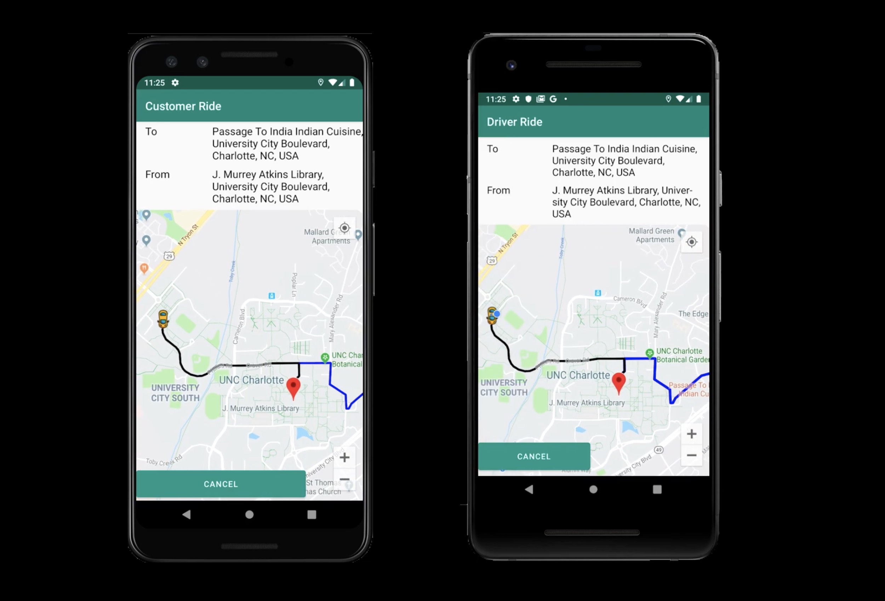

# Social RideSharing App

Android Application that provides ride sharing functionality to chatrooms. Users can put up request for a ride in chatrooms and other uses In that chatroom can respond to that request. Integration of google maps and firebase makes it easier for the rider to see the driver's live location.

[Click here](https://www.youtube.com/watch?v=cIK5y4v27Z4&feature=youtu.be) To watch the video demonstrating the workflow of this application.
